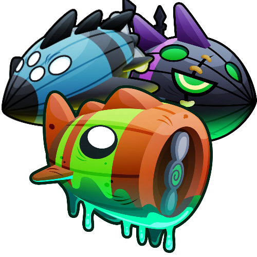

<h1 align="center">Boss Rounds</h1>

Adds Round Sets for all Bosses and their Elite versions chooseable in the Rount Set Changer, allowing you to play any boss on any map at any time. Sandbox also works, allowing you to test Bosses by sending their corresponding rounds.

You DO NOT receive the usual boss rewards / trophies for playing,  
instead you just get a nice chunk of extra Monkey Money.

Saving and loading on maps is fully functional, but know that you'll need to have  
the mod still installed when opening saves again for it to work.

